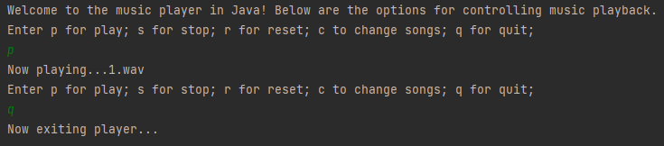

# java-music-player

The Java Music player is equipped with options to (p)lay, (s)top, (r)eset, (c)hange, and (q)uit songs. Pick one of the preceding letters and press enter. There are a total of five songs. Each song is random when changing between them.

(Be sure to have `openjdk 11.0.16` and `Apache Maven 3.6.3` installed on your system before trying the installation instructions below.)



##Installation Instructions

1. Clone the repo:

```sh
git clone https://github.com/xiraynedev/java-music-player.git
```

2. Change directory:

```sh
cd java-music-player
```

3. Run:

```sh
mvn package
```

4. Start the project by running:

```sh
java -cp target/java-music-player-1.0-SNAPSHOT.jar com.xiraynedev.app.App
```

If this error occurs in Linux,

`java.lang.IllegalArgumentException: No line matching interface Clip supporting format PCM_SIGNED 22000.0 Hz, 16 bit, mono, 2 bytes/frame, little-endian, and buffers of 4610 to 4610 bytes is supported`,

be sure to install PulseAudio with `sudo apt install pulseaudio`
